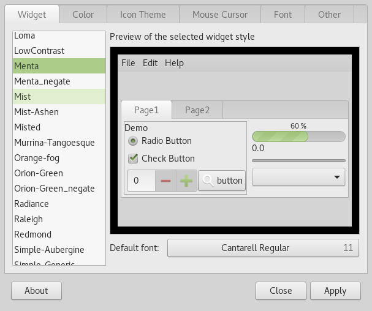
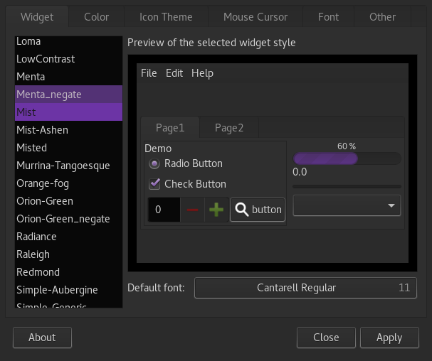
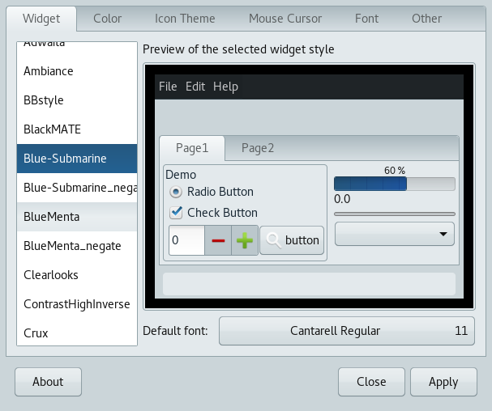
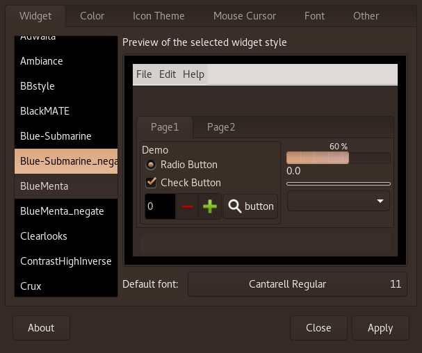

# negate-theme-color

Here is a little script to negate color of any theme GTK2, GTK3 or whatever.

## Why?

Because I was bored of not beeing able to find any descent/up-to-date GTK 3.20 dark/black theme, turns out that it was way easier to convert a complete light theme into a dark one.

## How does it look?

#### Menta theme:

Original | Negated
-------- | --------
 | 

#### Blue-Submarine theme:

Original | Negated
-------- | --------
 | 

## Hwo to use it?

`
./negate-theme-color.sh [theme directory]`

A copy of the specified directory will be created in `~/.themes` with _negate append to its name.

For example: `./negate-theme-color.sh /usr/share/themes/Menta` create `~/.themes/Menta_negate`.

